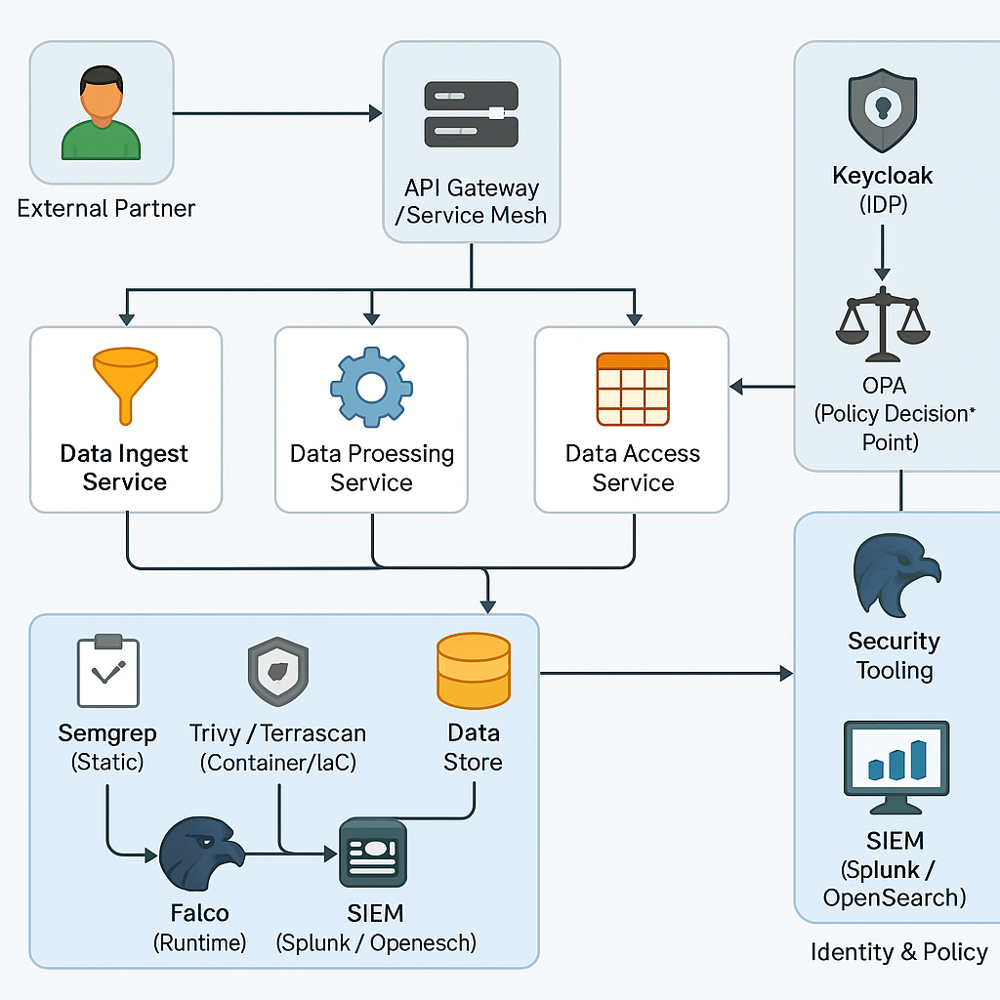

## Zero Trust Architecture Overview

This diagram illustrates the secure microservice flow, identity and policy enforcement, and integrated security tooling used in this lab. It supports RMF documentation by mapping technical controls to NIST SP 800-53 and providing evidence for implementation and monitoring phases.

